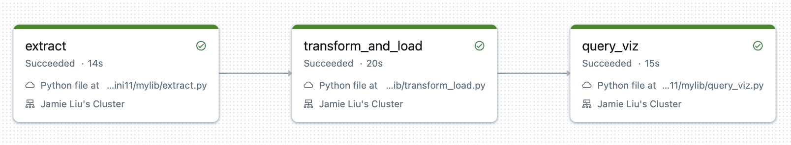
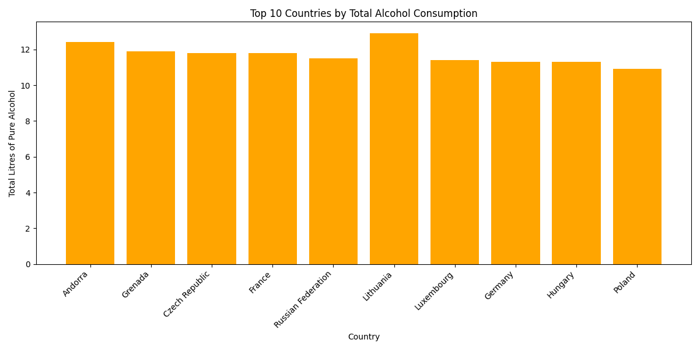
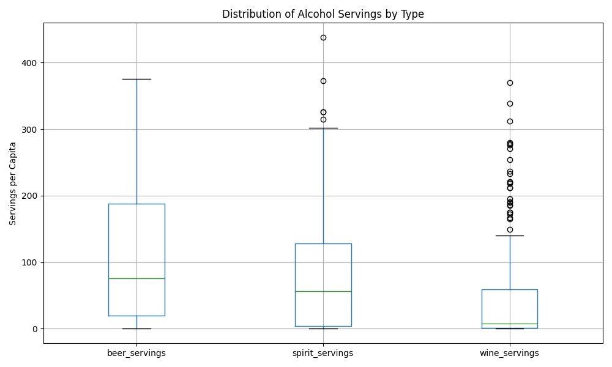

# JamieLiu_Mini11

[](https://github.com/nogibjj/JamieLiu_Mini11/actions/workflows/cicd.yml)

## Data Pipeline with Databricks

**Overview:**
The **Data Pipeline with Databricks** project demonstrates a data engineering workflow that extracts, transforms, and visualizes alcohol consumption data using Databricks in conjunction with Python libraries. The pipeline automates data processing and visualization while leveraging Databricks for computation and storage.

**Key Components:**

1. **Data Extraction:**

   - Uses the `requests` library to fetch the alcohol consumption dataset from fivethirtyeight.
   - Saves the extracted data to the Databricks FileStore.

2. **Databricks Environment Setup:**

   - Establishes a connection to the Databricks environment using environment variables for authentication (`SERVER_HOSTNAME` and `ACCESS_TOKEN`).

3. **Data Transformation and Load:**

   - Transforms the CSV file into a Spark DataFrame.
   - Converts the DataFrame into a Delta Lake Table and stores it in the Databricks environment.

4. **Query Transformation and Visualization:**

   - Defines a Spark SQL query to analyze and retrieve alcohol consumption data.
   - Uses the query results to create visualizations that highlight key trends in the dataset.

5. **File Path Checking for `make test`:**

   - Implements a function to verify the existence of specified file paths in the Databricks FileStore.
   - As most functionality relies on Databricks, GitHub CI cannot directly access the Databricks workspace. The test suite instead validates API connectivity with Databricks using the `requests` library.

6. **Automated Trigger via GitHub Push:**
   - The Databricks API triggers a job in the Databricks workspace when a user pushes updates to this repository.
   - Automates pipeline execution for new commits.

**Preparation:**

1. Create a Databricks workspace on Azure.
2. Connect your GitHub account to the Databricks workspace.
3. Create a global init script to store environment variables during cluster startup.
4. Create a Databricks cluster that supports PySpark.
5. Clone the repository into the Databricks workspace.
6. Create a job on Databricks to execute the pipeline.
7. Key tasks:
   - **Extract Task** (Data Source): `mylib/extract.py`
   - **Transform and Load Task** (Data Sink): `mylib/transform_load.py`
   - **Query and Visualization Task**: `mylib/query_viz.py`

---

## Job Run from Automated Trigger:



---

## Check Format and Test Errors:

1. Open Codespaces or run the repository locally in a terminal.
2. Format code:
   ```bash
   make format
   ```
3. Lint code:
   ```bash
   make lint
   ```

---

## Sample Visualizations from Query

### **Bar Chart: Top 10 Countries by Total Alcohol Consumption**



This bar chart highlights the top 10 countries with the highest total alcohol consumption (measured in litres of pure alcohol per capita). Lithuania leads among the countries, followed closely by Andorra.

---

### **Boxplot: Distribution of Alcohol Servings by Type**



The boxplot visualizes the distribution of alcohol servings (beer, spirits, and wine) per capita across all countries. It reveals:

- **Beer** has the widest range of servings, with some outliers consuming over 400 servings per capita.
- **Spirits** show significant variability, with a smaller number of high-consumption outliers.
- **Wine** generally has lower median consumption with a tighter spread, but also includes outliers.
